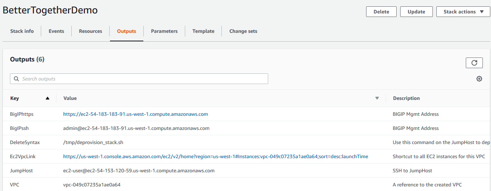

## 1) Deploy the CFT
1. Deploy the CFT and provide an EnvironmentName and Select your SSH-KeyPair
    * The EnvironmentName must be lowercase alpha and is used for naming of all created objects

2. Once your environment is created you can SSH into the JumpHost and Big-IP to start exploring the deployed infrastructure
    * As the JumpHost is provisioned it establishes environment variables, if you SSH in before they are populated you may have to exit your session and restart it


## 2) Verify your Demo Environment
### 2_A) Verify JumpHost
All steps in this session will assume you have successfully SSH to the JumpHost
1. Check /tmp/setup_k8s.log for error messages
2. Verify you have the correct number of K8s nodes were created
    * kubectl get nodes
    ```bash
    ## Example response
    [ec2-user@ip-10-10-1-10 tmp]$ kubectl get nodes
    NAME                                        STATUS   ROLES    AGE   VERSION
    ip-10-10-3-192.us-west-1.compute.internal   Ready    node     11m   v1.12.8
    ip-10-10-3-211.us-west-1.compute.internal   Ready    master   12m   v1.12.8
    ```
3. Verify the correct number of namespaces were created
    * kubectl get namespaces
    ```bash
    ## Example response
    [ec2-user@ip-10-10-1-10 tmp]$ kubectl get namespaces
    NAME            STATUS   AGE
    bigip-ingress   Active   3m36s
    default         Active   14m
    kube-public     Active   14m
    kube-system     Active   14m
    nginx-ingress   Active   13m
    ```
4. Verify correct number of pods exist in the nginx-ingress namespace
    * kubectl get pods -n nginx-ingress
    ```bash
    ## Example response
    [ec2-user@ip-10-10-1-10 tmp]$ kubectl get pods -n nginx-ingress
    NAME                                          READY   STATUS    RESTARTS   AGE
    nginx-ingress-controller-a-7855674844-z6fqj   1/1     Running   0          6m2s
    nginx-ingress-controller-b-jwqkj              1/1     Running   0          5m3s
    ```
5. If any of the pods in the nginx-ingress namespace are in a state OTHER than Running you can check the log for error messages
    * kubectl logs -n nginx-ingress nginx-ingress-controller-b-jwqkj

6. Verify correct number of pods exist in the bigip-ingress namespace
    * kubectl get pods -n bigip-ingress
    ```bash
    ## Example response
    [ec2-user@ip-10-10-1-10 tmp]$ kubectl get pods -n bigip-ingress
    NAME                                         READY   STATUS    RESTARTS   AGE
    k8s-bigip-ctlr-deployment-5647678499-pkzbc   1/1     Running   0          6m32s
    ```
7. If any of the pods in the bigip-ingress namespace are in a state OTHER than Running you can check the log for error messages
    * kubectl logs -n bigip-ingress k8s-bigip-ctlr-deployment-5647678499-pkzbc

### 2_B) Verify Big-IP
All steps in this session will assume you have successfully SSH to the Big-Ip and exited TMSH by typing bash
1. Check /tmp/firstrun.log for error messages
    ```bash
    ## Example steps
    admin@(ip-10-10-1-50)(cfg-sync Standalone)(Active)(/Common)(tmos)# bash
    [admin@ip-10-10-1-50:Active:Standalone] ~ # cat /tmp/firstrun.log
    Wed Jul 10 12:17:32 PDT 2019
    #....Truncated....
    ```
2. Verify service account was created
    * tmsh list auth user BigIPk8s
    ```bash
    ## Example response
    [admin@ip-10-10-1-50:Active:Standalone] ~ # tmsh list auth user BigIPk8s
    auth user BigIPk8s {
        description BigIPk8s
        encrypted-password $6$9crzcCdG$Ou9vrOG7iOa2p0tqiUWz8knZIIDtFTS1aAw9RsC6SukYPRa.gc4yIXLeQiLefK2jE.JJBuuf4TqPSD7mRL7pE.
        partition Common
        partition-access {
            all-partitions {
                role admin
            }
        }
        shell none
    }
    ```
3. Verify correct number of Self_IP were created
    * tmsh list net self
    ```bash
    ## Example response
    [admin@ip-10-10-1-50:Active:Standalone] ~ # tmsh list net self
    net self 10.10.3.51/24 {
        address 10.10.3.51/24
        allow-service {
            default
        }
        floating enabled
        traffic-group traffic-group-1
        unit 1
        vlan internal
    }
    net self 10.10.3.52/24 {
        address 10.10.3.52/24
        allow-service {
            default
        }
        traffic-group traffic-group-local-only
        vlan internal
    }
    net self 10.10.2.51/24 {
        address 10.10.2.51/24
        floating enabled
        traffic-group traffic-group-1
        unit 1
        vlan external
    }
    net self 10.10.2.52/24 {
        address 10.10.2.52/24
        traffic-group traffic-group-local-only
        vlan external
    }
    ```
